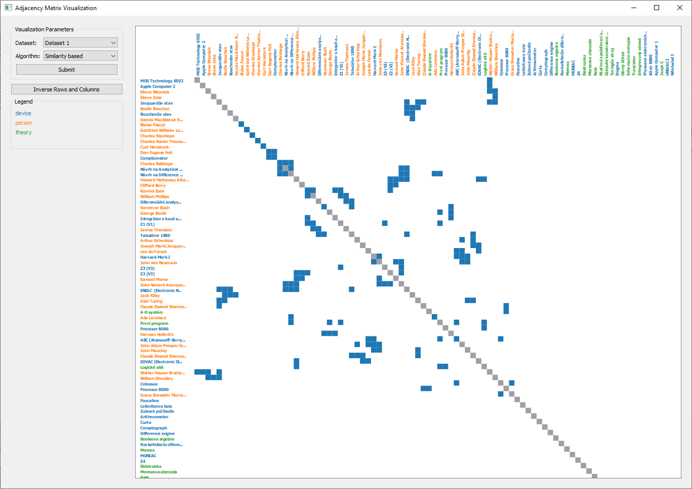

# Adjacency Matrix Visualization

Simple PyQt application for visualizing network with adjacency matrix.
The application was developed as a project for visualization class.

The goal of the visualization is to identify clusters in the heterogeneous network. 
There was used technique called **Adjacency Matrix Visualization**, 
where the main idea is to visualize a network as a matrix, 
and the challenge is to reorder columns and rows in such a way that the matrix will 
show cluster of path patterns. For more information see [Analysis report](Analysis%20report.pdf).



## Getting Started
### Package Requirements
General requirements:
* `Python = 3.6`
* `PyQt5 = 5.15`

Packages for working with the data:
* `NumPy = 1.19`
* `Pandas = 1.1`

Packages with algorithms for reordering the adjacency matrix:
* `SciPy = 1.5`


### Running the application

First, install required packages using `pip`.
```bash
pip install requirements.txt
```

Then run the application.
```bash
python main.py
```

## Authors
**Rail Chamidullin** - chamidullinr@gmail.com  - [Github account](https://github.com/chamidullinr)